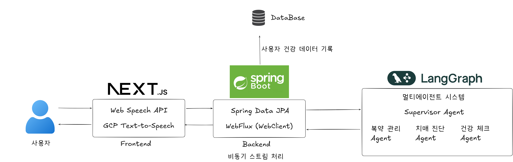
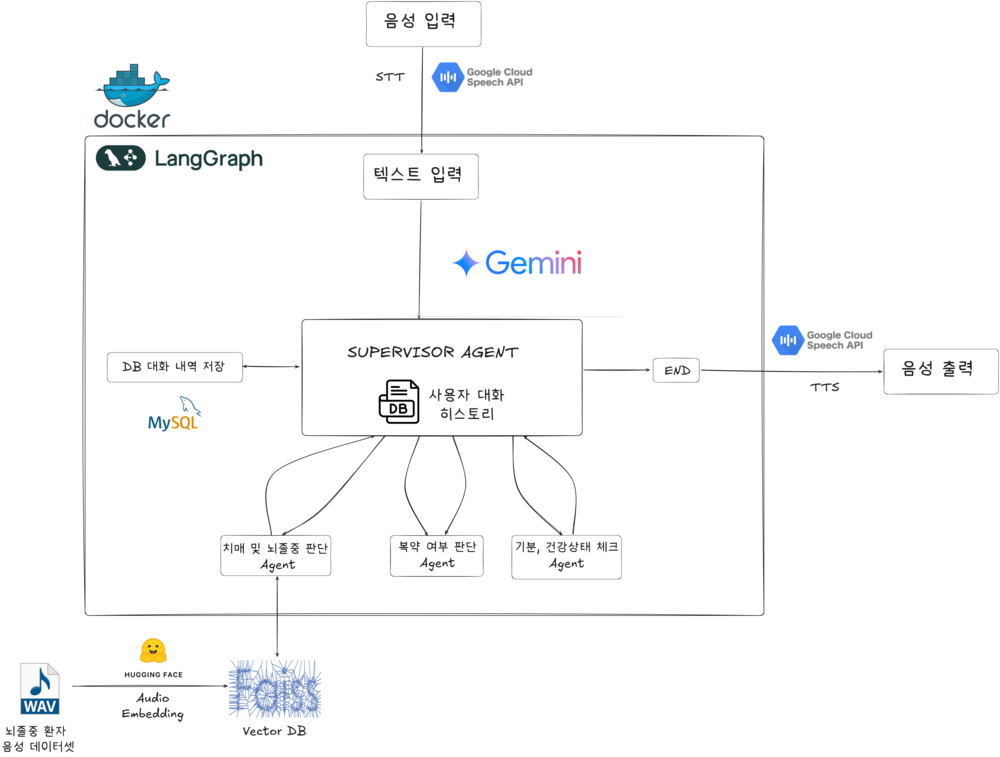

## 💡 우리가 만든 서비스는?

### 🎙️ **치매 예방을 위한 음성 대화 기반 AI 챗봇**

고령화가 심각한 지역, **의성군**의 현실을 마주하고  
“**기술로 고립된 노년층의 일상에 어떻게 힘을 줄 수 있을까?**”  
라는 질문에서 출발했습니다.

---

## 🌿 프로젝트 아키텍처



### 📋 아키텍처 설명

**3-Tier 아키텍처**로 구성된 풀스택 시스템:

1. **Frontend (Next.js + TypeScript)**
   - 고령층 친화적 UI/UX
   - 음성 인식 및 TTS 기능
   - 반응형 웹 디자인

2. **Backend (Spring Boot + Java)**
   - RESTful API 서버
   - 이메일 알림 시스템
   - 데이터베이스 관리

3. **AI Service (Python + FastAPI)**
   - 멀티 에이전트 구조
   - Gemini API 연동
   - 음성 분석 및 치매 검사

---

## 🤖 멀티 에이전트 구조 아키텍처



### 🔄 에이전트 플로우

**Supervisor Agent**가 사용자 입력을 분석하여 적절한 전문 Agent로 라우팅:

1. **치매 및 뇌졸중 판단 Agent**
   - DB에 저장된 대화 내역 분석으로 기억력 감퇴 여부 판단
   - 뇌졸중 환자 오디오 데이터셋 기반 Vector Embedding으로 뇌졸중 여부 판단

2. **복약 여부 판단 Agent**
   - 대화내역 토대로 노인이 약을 먹었는지 판단

3. **기분, 건강상태 체크 Agent**
   - 대화내역 분석으로 기분, 건강상태 체크 판단

---

## 🌿 주요 기능

- **자연어 기반 대화 인터페이스**  
  → 고령층 친화적 UX

- **멀티에이전트 구조**  
  → 병렬 처리를 통한 기능 분리 및 성능 향상

- **핵심 Agents**  
  - `Supervisor Agent` → 사용자 의도 분석 및 적절한 Agent로 라우팅
  - `치매 및 뇌졸중 판단 Agent` → 기억력 감퇴 및 뇌졸중 징후 분석
  - `복약 여부 판단 Agent` → 복약 상태 모니터링
  - `기분, 건강상태 체크 Agent` → 정신 건강 및 신체 상태 분석

- **MVP 시나리오 플로우**  
  `음성 대화 → 대화 내용 분석 → 건강 상태 진단 → 보호자 알림 및 리포트 전송`

---

## 🛠️ 핵심 코드 분석

### 🔧 AI Service (Garlic-Holic-AI)

#### 메인 통합 API (`main_final.py`)
```python
# 멀티 에이전트 구조의 핵심
class State(MessagesState):
    next: str = "supervisor"
    service_type: Optional[str] = None
    selected_agent: Optional[str] = None
    executed_agents: list = []
    dementia_result: Optional[dict] = None
    medicine_result: Optional[dict] = None
    mood_result: Optional[dict] = None

# Supervisor Agent - 사용자 의도 분석 및 라우팅
def supervisor_node(state: State) -> Command[Literal[*members, "__end__"]]:
    # 사용자 메시지 분석하여 적절한 Agent 선택
    # 치매 검사, 복약 알림, 기분 체크 중 분류
```

#### 치매 검사 시스템 (`langgraph_dementia_check.py`)
```python
# 발음 어눌함 검사
def check_pronunciation_clarity(state: DementiaCheckState):
    # MFCC 특징 추출로 발음 명확도 분석
    # 정상 발음 기준과 유사도 계산

# 기억력 검사
def check_memory_recall(state: DementiaCheckState):
    # 3일 이내 과거 대화와 현재 대화 비교
    # 기억력 점수 산출 (0.0-1.0)

# 반복 발화 검사
def check_repetitive_speech(state: DementiaCheckState):
    # 같은 문장 반복 패턴 탐지
    # 치매 징후 분석
```

### 🔧 Backend (Garlic-Holic-Backend)

#### 음성 처리 컨트롤러 (`VoiceController.java`)
```java
@RestController
@RequiredArgsConstructor
public class VoiceController {
    private final VoiceCoreService voiceCoreService;

    @PostMapping("/voice-chat")
    public ApiResponse<?> handleAudioUpload(@RequestParam("audio") MultipartFile audioFile) {
        // 음성 파일 업로드 처리
        // AI 서버로 전달하여 분석 요청
        DiagnosisResponse diagnosisResponse = voiceCoreService.chat(audioFile);
        return ApiResponse.success(CheckDementiaResponse.of(diagnosisResponse));
    }
}
```

#### 이메일 알림 시스템 (`MailController.java`)
```java
@GetMapping("/mail")
public ApiResponse<?> sendMail() throws MessagingException {
    // 오늘의 대화 데이터 수집
    String text = concatTodayFields(1L);
    
    // AI 서버에서 요약 및 분석 요청
    SummarizeResult result = aiServer.postSummery(text);
    
    // 보호자에게 이메일 발송
    ReportMailData reportMailData = new ReportMailData(
        LocalDateFormatter.fromLocalDateTime(LocalDateTime.now()),
        result.isDementia_suspicion() ? "치매 의심" : "정상",
        result.getSummary()
    );
    mailCoreService.sendMail("보호자이메일", reportMailData);
}
```

### 🔧 Frontend (Garlic-Holic-Frontend)

#### 메인 페이지 (`page.tsx`)
```typescript
// 음성 인식 및 TTS 통합 인터페이스
const handleNuriClick = async () => {
  // 누리 캐릭터 클릭 시 랜덤 인사말
  const greetings = [
    "안녕하세요 예정님! 저는 누리예요~",
    "오늘도 건강한 하루 보내세요!",
    "누리가 언제나 예정님과 함께할게요!"
  ];
  
  const randomGreeting = greetings[Math.floor(Math.random() * greetings.length)];
  
  // Google TTS 우선, 실패시 브라우저 TTS
  try {
    await speakText(randomGreeting, true);
  } catch {
    speakTextBrowser(randomGreeting);
  }
};
```

#### 음성 업로드 컴포넌트 (`AudioUploader.tsx`)
```typescript
const uploadAudio = async () => {
  const blob = new Blob(audioChunksRef.current, { type: 'audio/webm' });
  
  const data = new FormData();
  data.append('audio', blob, 'rec.webm');

  // 백엔드 API로 음성 파일 전송
  const res = await fetch(
    `${process.env.NEXT_PUBLIC_API_URL}/voice-chat`,
    { method: 'POST', body: data }
  );
};
```

---

## 🛠️ 기술적으로 도전했던 점

- **Gemini API 활용**  
  - 음성 인식 → 자연어 이해 → 상황별 응답 생성

- **GCP 기반 서버 배포 & 실시간 데모 제공**

- **멀티에이전트 구조 설계**  
  - 병렬 대화 처리 & 비동기 리포트 생성으로 성능 개선

- **풀스택 연동 직접 구현**  
  - Docker 기반 통합 API 구성 및 서버 연결까지 자체 처리

---

## 🙌 해커톤 소감

- 서로 처음 본 팀원이었지만,  
  **디자이너, 기획자, 프론트, 백엔드, AI 엔지니어**가 하나처럼 협업
- 발표 시간 제약으로 데모는 생략되었지만,  
  **기술성과 완성도**를 높이 평가받아 **우수상**을 수상했습니다.
- 기술을 통해 사회문제를 해결해보는 값진 경험이었습니다 💪